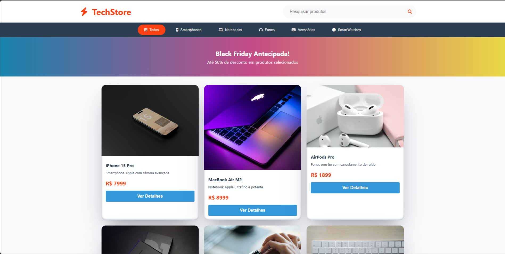

# 🛒 Projeto E-commerce

Este é um projeto simples de **E-commerce** desenvolvido para estudos.  
Ele apresenta uma página com produtos disponíveis para venda, permitindo navegação e interação de forma intuitiva.

## Tela do Projeto



## ✨ Funcionalidades

- 📂 Listagem de produtos  
- 🔍 Pesquisa por produtos  
- 🎯 Filtro por categoria  
- 💻 Layout responsivo  

## 🛠️ Tecnologias utilizadas

- HTML5  
- CSS3  
- JavaScript (ES6+)  

## 🚀 Como executar

1. Clone este repositório:
   ```bash
   git clone https://github.com/PabloFront20/projeto-eccomerce
